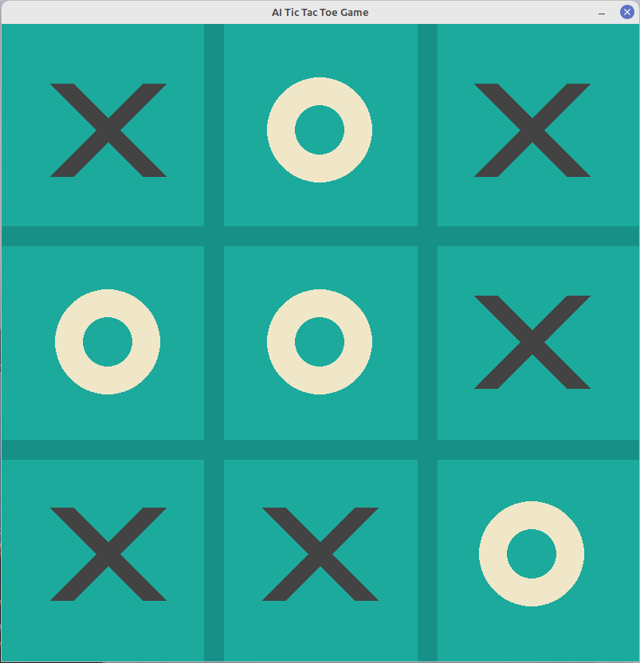

<div align=center>

# 🎮 PyGame AI Tic-Tac-Toe

### An Intelligent Tic Tac Toe Game with Minimax Algorithm

[](https://www.python.org/)
[](https://www.pygame.org/)
[](https://github.com/ADolbyB/pygame-ai-tictactoe/actions/workflows/build-release.yml)
[](https://github.com/ADolbyB/pygame-ai-tictactoe/blob/main/LICENSE.md)

[](https://github.com/ADolbyB/pygame-ai-checkers/stargazers)
[](https://github.com/ADolbyB/pygame-ai-checkers/network/members)
[](https://github.com/ADolbyB/pygame-ai-tictactoe)

[Overview](#-overview) •
[Features](#-features) •
[Screenshots](#-screenshots) •
[How to Play](#-how-to-play) •
[Installation](#-installation) •
[Project Structure](#-project-structure) •
[Algorithm](#-algorithm)

</div>

## 📋 Overview

An AI-powered Tic-Tac-Toe game built with Python and Pygame, featuring a minimax algorithm implementation for intelligent computer opponents, AI game research and algorithm exploration.

> **Note:** The baseline for this project was developed following the [Coding Spot: Tic Tac Toe AI with Minimax](https://www.youtube.com/watch?v=Bk9hlNZc6sE) tutorial as part of project research.

## ✨ Features

- **Intelligent AI Opponent**: Implements the minimax algorithm for optimal gameplay
- **Multiple Game Modes**: Switch between AI opponent and two-player mode
- **AI Difficulty Levels**: Choose between random AI moves and strategic minimax AI
- **Interactive Terminal Feedback**: Real-time game state information displayed in the console
- **Dynamic Controls**: Easy keyboard shortcuts for game control
- **Clean GUI**: Simple and intuitive Pygame interface

## 📸 Screenshots

### Game Board

<div align=center>

[](assets/GameBoard.png)

</div>

---

## 🎯 How to Play

### Game Controls

The game provides several keyboard commands for enhanced gameplay:

| Key | Action |
|-----|--------|
| `r` | Reset the game board and start a new match |
| `g` | Toggle game mode between AI opponent and 2-player mode |
| `0` | Set AI to random opponent (makes random valid moves) |
| `1` | Set AI to Minimax algorithm (optimal strategy) |

### Gameplay

1. **Starting the Game**: Launch the game by running `tictactoe.py`
2. **Making Moves**: Click on any empty square to place your mark (**X**)
3. **AI Response**: The AI (**O**) will automatically make its move based on the selected mode
4. **Terminal Feedback**: Check the console window for detailed game state information
5. **Winning**: Get three marks in a row (horizontal, vertical, or diagonal) to win
6. **Game Modes**:
   - **AI Mode (Default)**: Play against the computer
   - **2-Player Mode**: Take turns with another human player
   - **Random AI**: AI makes random valid moves (easier to beat)
   - **Minimax AI**: AI uses optimal strategy (very challenging)

---

## 🚀 Installation

### Prerequisites

- Python 3.10 or higher (for running from source)
- PyGame 2.5.2 or higher (for running from source)
- Conda or Mambaforge (recommended for development)
- Git

### Option 1: Download Pre-built Executable (Easiest) 🎯

**No Python installation required!** Just download and play.

#### Windows (64-bit)

1. **Download the latest release:**
   - Go to [Releases](https://github.com/ADolbyB/pygame-ai-tictactoe/releases/latest)
   - Download `tictactoe-win-x64.zip`

2. **Extract and run:**
```bash
   # Extract the ZIP file to your preferred location
   # Double-click tictactoe-game.exe to play!
```

3. **Play the game:**
   - No installation needed
   - Just run `tictactoe-game.exe`

#### Linux (64-bit)

1. **Download the latest release:**
   - Go to [Releases](https://github.com/ADolbyB/pygame-ai-tictactoe/releases/latest)
   - Download `tictactoe-linux-x64.tar.gz`

2. **Extract and run:**
```bash
   # Extract the archive
   tar -xzf tictactoe-linux-x64.tar.gz
   cd tictactoe-linux
   
   # Run the game
   ./run.sh
   # OR
   ./tictactoe-linux
```

> **Note:** Pre-built executables are standalone and don't require Python to be installed on your system.

---

### Option 2: Run from Source (For Development)

Perfect if you want to modify the code or contribute to the project.

#### Using Miniforge Environment (Recommended)

1. **Clone the repository:**
```bash
   git clone https://github.com/ADolbyB/pygame-ai-tictactoe.git
   cd pygame-ai-tictactoe
```

2. **Download Miniforge install script by Distro & Arch: Linux/MacOS/Win**

   - [Miniforge Releases](https://conda-forge.org/miniforge/)
   - GitHub [Repo](https://github.com/conda-forge/miniforge)

3. **Run Install Script & Initialize conda**
```bash
   bash Miniforge3-$(uname)-$(uname -m).sh
```

4. **Create and activate conda environment:**
```bash
   # Create environment with Python 3.10
   conda create -n tictactoe python=3.10
   
   # Activate the environment
   conda activate tictactoe
```

5. **Install dependencies:**
```bash
   # Install PyGame
   conda install conda-forge::pygame==2.5.2 numpy
```

6. **Run the game:**
```bash
   python tictactoe.py
```
---

### 🔧 System Requirements

#### For Pre-built Executables:
- **Windows:** Windows 10 or later (64-bit)
- **Linux:** Ubuntu 22.04+ or equivalent (64-bit)
- **RAM:** 512 MB minimum
- **Display:** 800x600 minimum resolution

#### For Running from Source:
- **Python:** 3.10 or higher
- **Pygame:** 2.5.2 or higher
- **OS:** Windows, Linux

---

## 📁 Project Structure

```
pygame-ai-tictactoe/
├── assets/
│   └── GameBoard.png          # Game preview image
├── constants.py               # Game constants and configuration
├── tictactoe.py              # Main game logic and minimax implementation
├── .gitignore                # Git ignore rules
└── README.md                 # This file
```

## 🧠 Algorithm

The minimax algorithm is a decision-making algorithm used in game theory and artificial intelligence. It works by:

1. **Evaluating all possible future game states** from the current position
2. **Assuming optimal play** from both players
3. **Maximizing the AI's chance to win** while minimizing the player's chance
4. **Selecting the best move** based on the evaluation

This implementation provides:
- Complete game tree exploration
- Optimal move selection for the AI
- Terminal state detection (win/loss/draw)
- Score-based decision making

## 🎓 Learning Resources

- **Tutorial**: [Tic Tac Toe AI with Minimax Algorithm](https://www.youtube.com/watch?v=Bk9hlNZc6sE)
- **Pygame Documentation**: [pygame.org](https://www.pygame.org/docs/)
- **Minimax Algorithm**: [Wikipedia - Minimax](https://en.wikipedia.org/wiki/Minimax)
- **Game Theory**: [Introduction to Game Theory](https://plato.stanford.edu/entries/game-theory/)

### Game States

The game tracks several states:
- **Player Turn**: Alternates between `X` (human) and `O` (AI)
- **Board State**: 3x3 grid tracking all moves
- **Win Conditions**: Checks all rows, columns, and diagonals
- **Draw Detection**: Identifies when the board is full with no winner

## Development Notes

This project was created as part of research into game AI and algorithm implementation. The tutorial provided the foundation for understanding:
- Game tree algorithms
- Minimax strategy
- Python game development with Pygame
- Interactive GUI design
- AI opponent implementation

## Future Enhancements

Potential improvements for future versions:
- [ ] Add alpha-beta pruning for performance optimization
- [ ] Implement difficulty levels (Easy, Medium, Hard)
- [ ] Add move history and undo functionality
- [ ] Create a scoring system across multiple games
- [ ] Add sound effects and animations
- [ ] Implement different board sizes (4x4, 5x5)
- [ ] Add a visual representation of the AI's thinking process

## 🤝 Contributing

Contributions are welcome! If you'd like to improve this project:

1. Fork the repository
2. Create a feature branch (`git checkout -b feature/YourFeature`)
3. Commit your changes (`git commit -m 'Add some feature'`)
4. Push to the branch (`git push origin feature/YourFeature`)
5. Open a Pull Request

## 📝 License

This project is licensed under the GNU GPL v3 License - see the [License](https://github.com/ADolbyB/pygame-ai-tictactoe/blob/main/LICENSE.md) file for details.

---

## 👨‍💻 Author

**Joel Brigida**

- GitHub: [@ADolbyB](https://github.com/ADolbyB)
- Project Link: [https://github.com/ADolbyB/pygame-ai-tictactoe](https://github.com/ADolbyB/pygame-ai-checkers)

---

## Acknowledgments

- Tutorial by [Coding Spot](https://www.youtube.com/watch?v=Bk9hlNZc6sE) for the foundational implementation
- Pygame community for comprehensive documentation
- Minimax algorithm researchers for foundational AI concepts

---

<div align="center">

### ⭐ If you found this project helpful, please consider giving it a star!

</div>

---

### Topics

`python` `ai` `tic-tac-toe` `pygame` `minimax-algorithm` `ai-games` `game-theory` `artificial-intelligence`